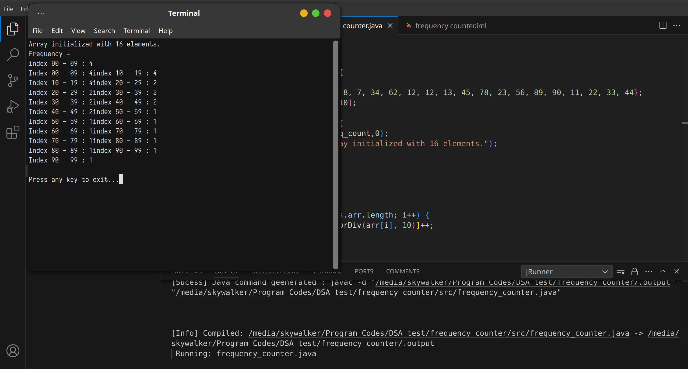
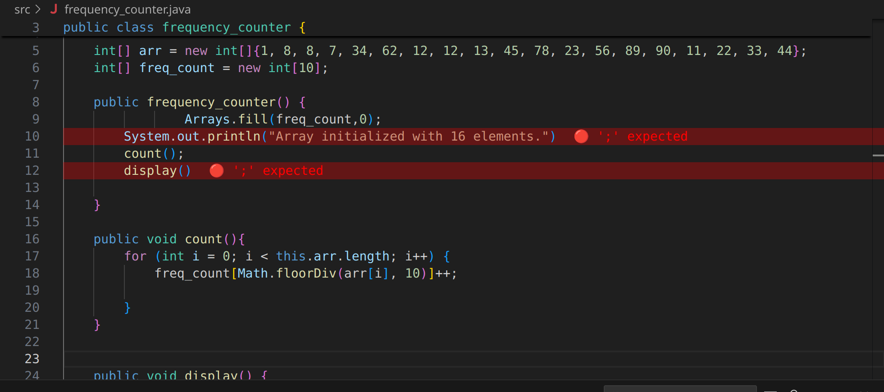
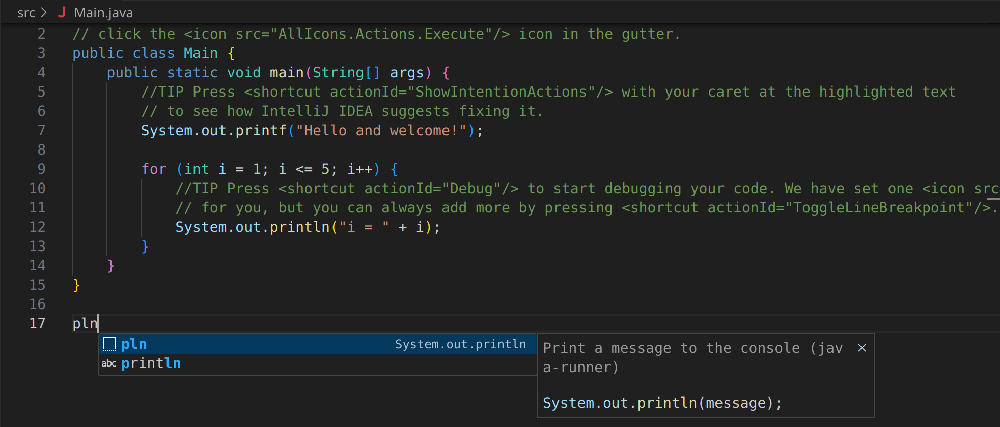

# JRunner - VS Code Extension for Running Java Programs

JRunner is a VS Code extension that simplifies the process of compiling and running Java programs directly from the editor. It provides helpful error reporting and interactive feedback, making it easier to troubleshoot issues during the development process. The extension supports **running Java files in an external terminal** and provides **syntax highlighting for compilation errors**. This extension also provides shorthand **snippets** to make it easy to type long lenghty code.

## Screenshots

<b style="font-size:1.5rem">Run in external terminal:</b>

<b style="font-size:1.5rem">Inline Compilation error highliting:</b>

<b style="font-size:1.5rem">Easy shotcuts and snippets:</b>

## Usage

- **Running Code**: **Shift+f8** or **F8** to run

## Features

- **Run Java Programs**: Execute Java programs directly from VS Code using the `Run Java` command.
- **Compilation Error Highlighting**: Automatically highlights errors in the editor with red background and error messages for easy identification.
- **Interactive Terminal**: Runs Java programs in an external terminal, allowing for full output visibility and interaction.

## Requirements
- **Java**: JDK 8 or above.

## Installation

1. Open VS Code.
2. Navigate to the **Extensions** view (Ctrl+Shift+X).
3. Search for `JRunner`.
4. Click on the `Install` button.

## Usage

### Running Java Code
1. Open a `.java` file in the editor.
2. Press `Ctrl+Shift+P` to open the command palette.
3. Search for and select **Run Java**.
4. The Java program will be compiled, and if successful, it will be executed in an external terminal.

### Error Handling
- If there are compilation errors, they will be highlighted in the editor, and a detailed error message will appear in the output channel.
- Errors are parsed and aggregated to handle cases where multiple errors occur on the same line.

### Configuration

The extension works automatically by detecting Java files and running them in the appropriate context. However, you can customize the output channel and terminal behavior based on your OS.

- **Windows**: Opens in `cmd.exe`.
- **macOS**: Opens in the built-in `Terminal` app.
- **Linux**: Opens in the default terminal emulator (e.g., `gnome-terminal`).

## Commands

- **Run Java**: Executes the Java program from the currently open `.java` file.

## Error Messages
The following error levels are displayed with color-coding for better visibility:

- **Error**: Red
- **Success**: Green
- **Info**: Blue

These messages appear in the output channel and are also displayed in the editor as inline decorations.

# Snippets

## Basic usages:

<!-- | **Snippet**             | **Expansion**                                                                                                                                               |
|--------------------------|-------------------------------------------------------------------------------------------------------------------------------------------------------------|
| **pvsm,main**          | `public static void main(String[] args) {  }`                                                                                         |
| **fori**             | `for (int i = 0; i < n; i++) { }`                                                                                                   |
| **foreach**    | `for (Type element : collection) { }`                                                                                                    |
| **try**      | `try {  } catch (Exception e) {  }`                                                                              |
| **fun**    | `public void methodName(parameters) { }`                                                                                               |
| **interface** | `public interface InterfaceName { }`                                                                                                |
| **if**         | `if (condition) { }`                                                                                          |
| **ifelse**    | `if (condition) {  } else {  }`                                                                |
| **switch**| `switch (variable) { `   `case value1:  break; `   ` case value2:  break;  `   `default:  `   `}`                   |
| **getter**        | `public Type getPropertyName() { return property; }`                                                                                                     |
| **Setter**        | `public void setPropertyName(Type value) { this.property = value; }`                                                                                      | -->

| **Snippets**               | **Expansion**                                                                                                 |
|----------------------------|-------------------------------------------------------------------------------------------------------------|
| **`main`, `psvm`**            |  → `public static void main(String[] args) { ... }`                                           |
| **`fori`**               |  → `for (int i = 0; i < n; i++) { ... }`                                                              |
| **`foreach`**      |  → `for (Type element : collection) { ... }`                                                      |
| **`try`**        | → `try { ... } catch (Exception e) { ... }`                                                           |
| **`fun`**      |  → `public void methodName(parameters) { ... }`                                                       |
| **`interface`**   |  → `public interface InterfaceName { ... }`                                                     |
| **`if`**           |  → `if (condition) { ... }`                                                                            |
| **`ifelse`**      | → `if (condition) { ... } else { ... }`                                                           |
| **`switch`**  |  → `switch (variable) { case value1: ...; break; default: ... }`                                   |
| **`getter`**          | → `public Type getPropertyName() { return property; }`                                            |
| **`setter`**          |  → `public void setPropertyName(Type value) { this.property = value; }`                            |
| **`sout`, `print`, `pln`, `prt`**     |  → `System.out.println(message);`                                             |
| **`souf`, `print`, `pf`**      |  → `System.out.printf(message);`                                                      |
| **`scan`, `inp`, `sc`**          |  → `Scanner scannerName = new Scanner(System.in);`                                      |
| **`scint`**       |  → `int variableName = scannerName.nextInt();`                                                      |
| **`scstr`**    |  → `String variableName = scannerName.nextLine();`                                                  |
| **`scchar`**      |  → `char variableName = scannerName.nextLine().charAt(0);`    

## Feedback

If you encounter any issues or have suggestions for improvement, please open an issue in [GitHub repository](https://github.com/Upokharel56/jrunner)

---

<b style="font-size:1.5rem">Enjoy coding with jrunner!😊 </b>

